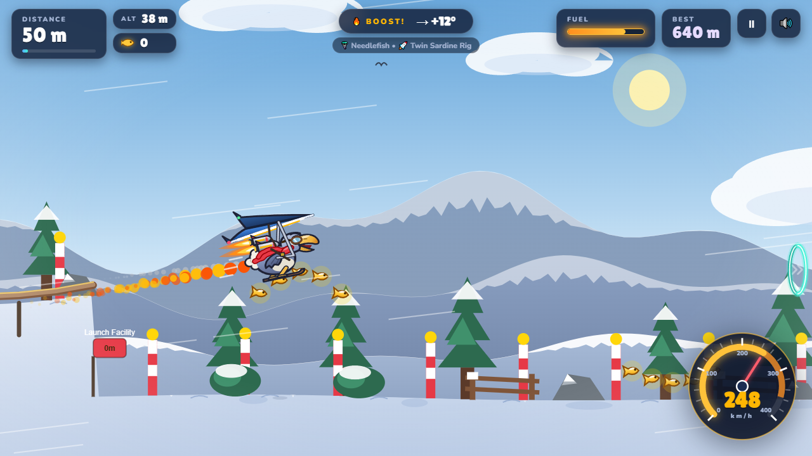
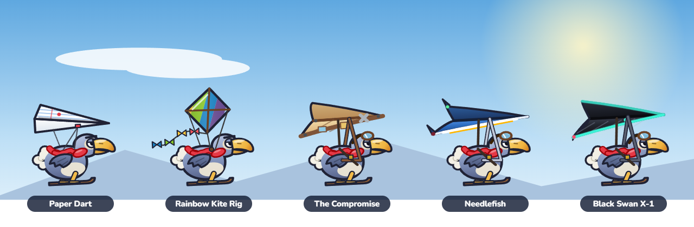
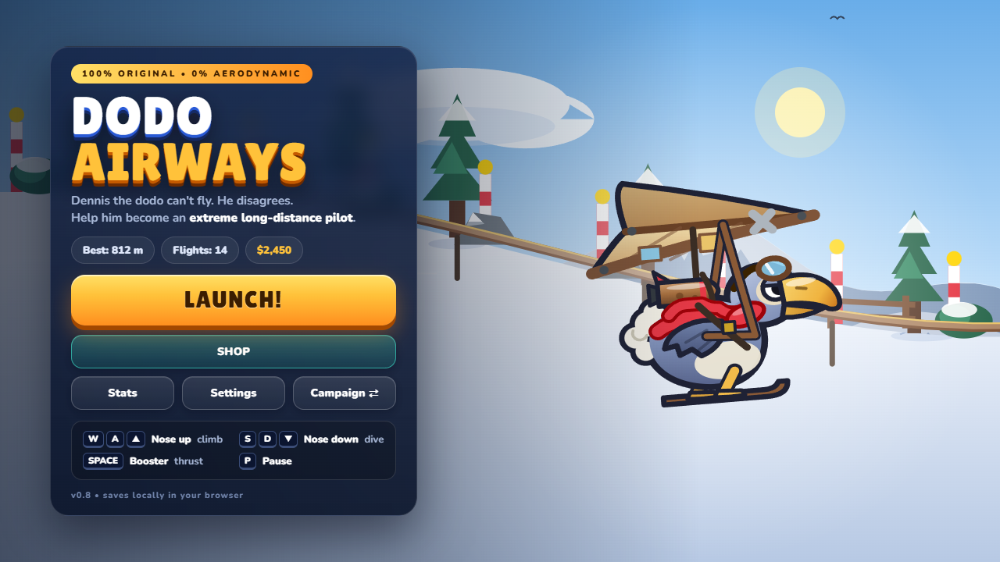

<div align="center">

# 🦤 Dodo Airways

**Dennis the dodo can't fly. He disagrees.**

A small launch-and-upgrade game that runs in your browser. Slide down a snowy ramp, glide as far as you can, spend what you earn on better gear, and go again.

### [▶ Play now](https://joji228.github.io/Fly-to-Learn/)

No install or sign-up. Works on desktop and mobile.



</div>

## How to play

Every flight starts on the launch ramp. Once you leave the lip, you steer by tilting Dennis's nose:

- **Dive** to build speed.
- **Pull up** to trade that speed for height.
- **Level out** to glide as far as possible.

Climb too steeply and you stall. Flare just before touchdown for a smooth landing. Farther, higher, faster and longer flights all pay more.

| Action | Keyboard | Touch |
|---|---|---|
| Nose up | `W` `A` `↑` `←` | ▲ button |
| Nose down | `S` `D` `↓` `→` | ▼ button |
| Booster (once you own a rocket) | `Space` | 🔥 button |
| Pause | `P` or `Esc` | ⏸ button |

## What's in the game

**Golden fish and gust rings.** Fish are worth $4 each and chime higher when you grab them in a row. Flying through a gust ring adds 7 m/s. They sit in the same places every flight, so you can learn the route.

**Landing islands.** Past the shoreline, Palm Isle, Floe Berg, Gull Rock and City Isle are the only dry land. A smooth landing pays more the farther out it is, and landing smoothly several times in a row builds a streak bonus.

**Gliders.** Dennis starts with no wings at all and falls like a rock. Each glider in the hangar flies noticeably better than the last:



| Glider | Price | Rocket | Price |
|---|---|---|---|
| Paper Dart | $200 | Puddle-Jumper | $350 |
| Rainbow Kite Rig | $700 | Twin Sardine Rig | $2,800 |
| The Compromise | $1,900 | Dodo-Star Engine | $12,000 |
| Needlefish | $5,500 | | |
| Black Swan X-1 | $17,000 | | |

**Workshop upgrades.** Five permanent upgrades:

- **Launch Ramp:** higher and faster launches.
- **Waddle Sled:** a shorter ride down the ramp and extra launch speed.
- **Aerodynamics:** less drag and a higher top speed.
- **Rocket Fuel:** longer burns.
- **Nitro Mix:** harder thrust.

**Objectives.** 25 bonus goals cover distance, altitude, speed, airtime, landings and islands. Finish every one to turn Dennis golden.

**Two save slots.** Campaign is the normal progression. Sandbox unlocks everything so you can experiment, and it never touches your Campaign progress. You can export or import saves from Settings.

<p align="center"></p>

## Run it locally

It's a static site, so there's nothing to build. Clone the repo and serve the folder:

```bash
git clone https://github.com/Joji228/Fly-to-Learn.git
cd Fly-to-Learn
python -m http.server 8000
```

Then open <http://localhost:8000>. Opening `index.html` directly also works, but some browsers won't save progress from `file://` pages.

## Tests

```bash
node scripts/run-all.js
```

This runs every test suite in `tests/` plus an exploit check that makes sure even fully upgraded gear can't keep Dennis in the air forever. It needs Node and nothing else. The tuning simulations in `scripts/` (`balance.js`, `economy.js`, `skill-ceiling.js`) print how far each glider flies and how many flights it takes to buy everything.

## Project layout

```
index.html        markup for every screen
css/style.css     all styling
js/
  config.js       upgrades, objectives, milestones, prices
  gliders.js      glider and rocket stats and artwork, shop previews
  physics.js      flight model and rewards
  world.js        terrain, scenery and Dennis
  pickups.js      golden fish and gust rings
  game.js         game loop, input, camera, crashes, results
  ui.js           menus, HUD, shop, results, settings
  audio.js        sound effects and music, all generated in code
  save.js         saving, loading and save migrations
tests/            regression tests (plain Node)
scripts/          test runner and tuning simulations
```

## Built with

Plain HTML, CSS and JavaScript on a `<canvas>`. There are no frameworks, no build step and no image or audio files: every sprite is drawn in code and every sound is synthesized with the Web Audio API. Progress is saved in your browser's `localStorage`. The only thing loaded from outside the repo is the fonts (Lilita One and Nunito, from Google Fonts), and the game falls back to system fonts offline.

## Changelog

- **0.10:** Audit fixes: readable results screen (longer beat before the shop, no Enter double-launch), boost-audio node cleanup, HUD write savings, save-import hardening (objective allowlist, wallet caps), stale speedo needle reset.
- **0.9:** Rebuilt shop with Gliders, Rockets and Workshop tabs, a next-purchase goal bar and cleaner cards. New Nitro Mix artwork. Map fixes: the shoreline is now a snow bank, islands rise out of the sea, waves follow the water, and boats, buoys and the city sit in the right places. Milestones are readable signboards.
- **0.8:** Dennis, all gliders and rockets redrawn. New HUD, menus, shop and results screen. The game runs faster with a closer camera. Added golden fish and gust rings.
- **0.7:** Fixed the pause menu dropping your flight. Added W/S and ↑/↓ steering. BEST updates live during record flights.
- **0.6 and earlier:** landing islands, streak and glide bonuses, Nitro Mix, Sandbox mode, and the deterministic flight model.
